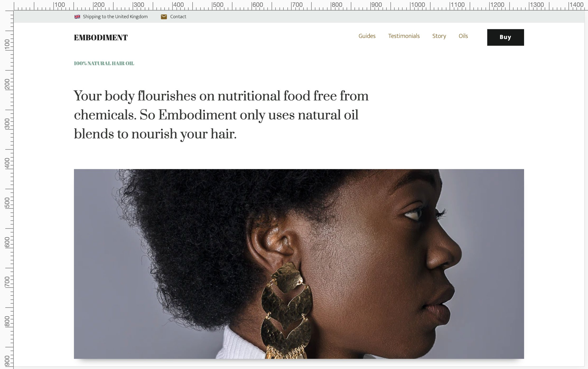

# Embodiment

[](https://app.netlify.com/sites/embodiment/deploys)

> Embodiment. A 100% natural hair oil product to moisturize and restore vitality to curly hair. @ https://embodimentshop.com



## Development

```bash
# install dependencies
$ yarn install

# serve with hot reload at localhost:3000
$ yarn dev

# build for production and launch server
$ yarn build
$ yarn start

# generate static project
$ yarn generate
```

For a detailed explanation on how things work, check out [Nuxt.js docs](https://nuxtjs.org).

## Roadmap

### Stage 1

- [x] Microsite
- [x] Stripe payment integration
- [ ] Social media share links

### Stage 2

- [ ] Analytics
- [ ] Review mobile and vertical spacings
- [ ] Componentize appropriate modules, especially where there is duplication
- [ ] 90% lighthouse score on all pages
- [ ] Components test
- [ ] Canonical urls and redirect to www (inc. sitemap)

### Stage 3

- [ ] Limit number of products available dynamically
- [ ] Send automated email receipts
- [ ] Server tests
- [ ] Fix lamba build pipeline

### Stage 4

- [ ] Create dedicated pricing page
- [ ] Sell subscription
- [ ] Testing in production and monitoring

## Resources

https://macarthur.me/posts/building-a-lambda-function-with-netlify

Submit a sitemap:

http://www.google.com/ping?sitemap=https://www.embodimentshop.com/sitemap.xml
